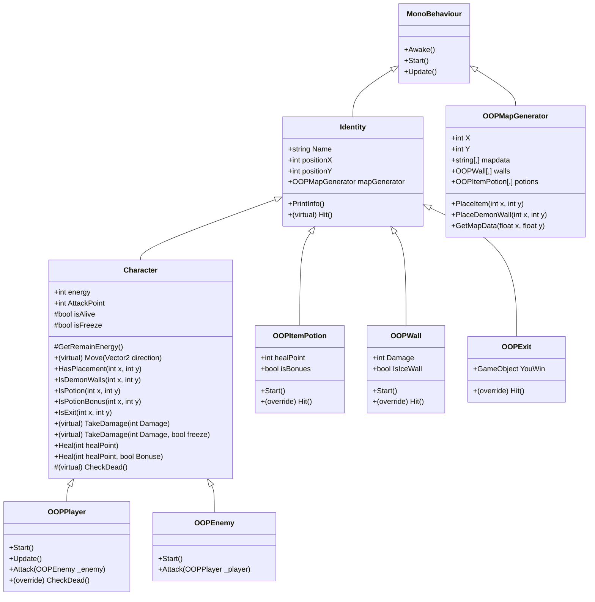

# 🎮 คู่มือปฏิบัติการ: การเขียนโปรแกรมเชิงวัตถุ (OOP) บน Unity
### สัปดาห์ที่ 03: การประยุกต์ใช้หลักการ OOP ในการพัฒนาเกม 2D Grid Rogue-like

> คู่มือนี้จัดทำขึ้นเพื่อเป็นแนวทางการเรียนรู้และการพัฒนาโค้ดทีละขั้นตอน สำหรับ**นักศึกษา** (ใช้ศึกษาและฝึกปฏิบัติตามด้วยตนเอง) และ**ผู้สอน** (ใช้เป็นแนวทางการบรรยายและทำ Live-Coding ในชั้นเรียน)

เอกสารชุดนี้จะพาคุณค่อยๆ ปรับปรุงและพัฒนาโค้ดจากโครงสร้างเริ่มต้นในโฟลเดอร์ `Student/` จนกลายเป็นระบบเกมที่สมบูรณ์ตามโฟลเดอร์ `Solution/` โดยมีลำดับขั้นตอนกำกับอย่างชัดเจน (เช่น `[Type 1.1]`, `[Type 1.2]`, `[Type 2.1]`, ...) เพื่อให้ปฏิบัติตามได้อย่างราบรื่นและเข้าใจเหตุผลเบื้องหลังของการออกแบบสถาปัตยกรรมโค้ด

---

## 📋 สารบัญ
1. [วัตถุประสงค์การเรียนรู้และหัวใจสำคัญของ OOP](#1-วัตถุประสงค์การเรียนรู้และหัวใจสำคัญของ-oop)
2. [สถาปัตยกรรมคลาสและแผนภาพ UML (Class Diagram)](#2-สถาปัตยกรรมคลาสและแผนภาพ-uml-class-diagram)
3. [ตารางเปรียบเทียบโค้ดเริ่มต้น (Starter) และเวอร์ชันสมบูรณ์ (Solution)](#3-ตารางเปรียบเทียบโค้ดเริ่มต้น-starter-และเวอร์ชันสมบูรณ์-solution)
4. [ลำดับขั้นตอนการเขียนโค้ดทีละสเต็ป (Implementation Sequence)](#4-ลำดับขั้นตอนการเขียนโค้ดทีละสเต็ป-implementation-sequence)
   - [Phase 1: การสร้างคลาสแม่พื้นฐาน (`Identity.cs`)](#phase-1-การสร้างคลาสแม่พื้นฐาน-identitycs)
   - [Phase 2: การพัฒนาคลาสแม่ของสิ่งมีชีวิต (`Character.cs`)](#phase-2-การพัฒนาคลาสแม่ของสิ่งมีชีวิต-charactercs)
   - [Phase 3: อ็อบเจกต์ที่โต้ตอบได้บนแผนที่ และการประยุกต์ใช้ Polymorphism (`OOPWall.cs`, `OOPItemPotion.cs`, `OOPExit.cs`)](#phase-3-อ็อบเจกต์ที่โต้ตอบได้บนแผนที่-และการประยุกต์ใช้-polymorphism-oopwallcs-oopitempotioncs-oopexitcs)
   - [Phase 4: คลาสควบคุมผู้เล่นและศัตรู (`OOPPlayer.cs`, `OOPEnemy.cs`)](#phase-4-คลาสควบคุมผู้เล่นและศัตรู-oopplayercs-oopenemycs)
   - [Phase 5: การปรับปรุงโครงสร้างตัวสร้างแผนที่ (`OOPMapGenerator.cs`)](#phase-5-การปรับปรุงโครงสร้างตัวสร้างแผนที่-oopmapgeneratorcs)
5. [การตรวจสอบและการตั้งค่าใน Unity Inspector](#5-การตรวจสอบและการตั้งค่าใน-unity-inspector)
6. [ตารางขั้นตอนการทดสอบระบบเกม (Playtest Matrix)](#6-ตารางขั้นตอนการทดสอบระบบเกม-playtest-matrix)
7. [คำถามทบทวนความเข้าใจและแนวคิดสำคัญ (Key Conceptual Review)](#7-คำถามทบทวนความเข้าใจและแนวคิดสำคัญ-key-conceptual-review)

---

## 1. วัตถุประสงค์การเรียนรู้และหัวใจสำคัญของ OOP

ในการฝึกปฏิบัติการครั้งนี้ ผู้เรียนจะได้ทำความเข้าใจและนำหลักการสำคัญของการเขียนโปรแกรมเชิงวัตถุไปใช้งานจริง ได้แก่:

| หลักการ OOP | การนำไปประยุกต์ใช้ใน Workshop | คำสำคัญ (Keywords) |
| :--- | :--- | :--- |
| **การสืบทอดคุณสมบัติ (Inheritance)** | จัดโครงสร้างลำดับชั้นของคลาส: `Identity` $\rightarrow$ `Character` $\rightarrow$ `OOPPlayer` / `OOPEnemy` และ `Identity` $\rightarrow$ `OOPWall`, `OOPItemPotion`, `OOPExit` ช่วยตัดโค้ดที่ซ้ำซ้อนและรวมศูนย์ข้อมูลที่ใช้ร่วมกัน | `:`, `base` |
| **การแทนที่เมธอด (Method Overriding)** | ประกาศเมธอด `virtual void Hit()` ในคลาสแม่ `Identity` แล้วเปิดให้คลาสลูก (`OOPWall`, `OOPItemPotion`, `OOPExit`) นำไปเขียนทับ (`override`) เพื่อแสดงพฤติกรรมเฉพาะตัวเมื่อเกิดการมีปฏิสัมพันธ์ รวมถึงการแทนที่ `CheckDead()` ใน `OOPPlayer` | `virtual`, `override` |
| **การโอเวอร์โหลดเมธอด (Method Overloading)** | นิยามเมธอดชื่อเดียวกันแต่รับชุดพารามิเตอร์ต่างกัน เพื่อรองรับบริบทการทำงานที่ยืดหยุ่น เช่น `TakeDamage(int)` กับ `TakeDamage(int, bool)` และ `Heal(int)` กับ `Heal(int, bool)` | Method Signature |
| **การห่อหุ้มและการกำหนดสิทธิ์ (Encapsulation & Access Modifiers)** | การปกป้องตัวแปรและสถานะภายในไม่ให้ถูกแทรกแซงจากภายนอกโดยไม่จำเป็น (`protected bool isFreeze`, `protected bool isAlive`) และเปิดให้เรียกใช้งานผ่านช่องทางที่ควบคุมได้ (`TakeDamage`, `Heal`, `Move`) | `public`, `protected`, `private` |
| **หลักการลดความซ้ำซ้อน (DRY: Don't Repeat Yourself)** | ฟังก์ชัน `Heal(int)` ส่งต่องานไปยัง `Heal(int, false)` เพื่อรวมตรรกะการคำนวณพลังงานไว้ที่จุดเดียว ไม่ต้องเขียนสูตรคำนวณซ้ำ | Code Reusability |

---

## 2. สถาปัตยกรรมคลาสและแผนภาพ UML (Class Diagram)

แผนภาพด้านล่างแสดงโครงสร้างความสัมพันธ์และการสืบทอดของคลาสทั้งหมดในโปรเจกต์:



---

## 3. ตารางเปรียบเทียบโค้ดเริ่มต้น (Starter) และเวอร์ชันสมบูรณ์ (Solution)

| ไฟล์สคริปต์ | สถานะเริ่มต้น (`Student/`) | สถานะสมบูรณ์ (`Solution/`) | สิ่งที่ได้เรียนรู้ |
| :--- | :--- | :--- | :--- |
| `Identity.cs` | มีเฉพาะตัวแปรระบุตัวตน (`Name`, `positionX`, `positionY`, `mapGenerator`) | เพิ่มเมธอด `PrintInfo()` และจุดเชื่อมโยง `virtual void Hit()` สำหรับ Polymorphism | การวางรากฐานของคลาสแม่ (Base Class) |
| `Character.cs` | สืบทอด `MonoBehaviour`, มีตัวแปรพิกัดซ้ำซ้อน, ฟังก์ชันตรวจสอบแผนที่คืนค่าหลอก `false`, ยังไม่มีระบบเดิน `Move()` | สืบทอด `Identity`, เติมระบบเดิน `Move()` พร้อมกลไกแช่แข็ง, ฟังก์ชันตรวจสอบประเภทช่องตาราง, และ Method Overloading สำหรับพลังงาน | การสืบทอดหลายระดับ (Multi-level Inheritance) และ Method Overloading |
| `OOPPlayer.cs` | สืบทอด `MonoBehaviour`, มีตัวแปรพิกัดซ้ำซ้อน, โค้ดรับ Input ยังไม่สมบูรณ์ | สืบทอด `Character`, เชื่อมต่อ Unity Input System (Action `"Move"`), อ่านค่า `moveAction.ReadValue<Vector2>()`, ส่งต่อให้ `Move(direction)`, เพิ่มฟังก์ชัน `Attack(OOPEnemy)`, และ `override CheckDead()` | การควบคุมตัวละครและการต่อยอดเมธอดของคลาสแม่ |
| `OOPEnemy.cs` | คลาสว่างเปล่า | สืบทอด `Character`, เพิ่มการเริ่มต้นใน `Start()` และฟังก์ชัน `Attack(OOPPlayer)` | การใช้ประโยชน์จากคลาสแม่เพื่อสร้าง Entity ชนิดใหม่ได้อย่างรวดเร็ว |
| `OOPWall.cs` | สืบทอด `MonoBehaviour`, มีตัวแปรพิกัดซ้ำซ้อน, ยังไม่มีการทำงาน | สืบทอด `Identity`, สุ่มเป็นกำแพงน้ำแข็ง 20%, `override Hit()` สร้างความเสียหาย/แช่แข็งผู้เล่น | การใช้ Polymorphism ในการโต้ตอบเมื่อเกิดการชน |
| `OOPItemPotion.cs` | สืบทอด `MonoBehaviour`, มีตัวแปรพิกัดซ้ำซ้อน, ยังไม่มีการทำงาน | สืบทอด `Identity`, สุ่มเป็นยาโบนัส 20%, `override Hit()` เพิ่มพลังงานให้ผู้เล่น (โบนัส 2 เท่า) | การแยกพฤติกรรมของไอเทมออกจากคลาสตัวละคร |
| `OOPExit.cs` | สืบทอด `MonoBehaviour`, มีตัวแปรพิกัดซ้ำซ้อน | สืบทอด `Identity`, `override Hit()` ปิดการควบคุมของผู้เล่นและเปิด UI แสดงชัยชนะ (`YouWin`) | การสร้างจุดสิ้นสุดเงื่อนไขชนะเกม |
| `OOPMapGenerator.cs` | โค้ดสร้างวัตถุในลูป `while` มีความซ้ำซ้อน | แยกการทำงานออกเป็น Helper Method `PlaceItem(x, y)` และ `PlaceDemonWall(x, y)` | การจัดระเบียบโค้ดตามหลัก Clean Code |

---

## 4. ลำดับขั้นตอนการเขียนโค้ดทีละสเต็ป (Implementation Sequence)

```
┌───────────────────────────────────────────────────────────────────────────────────────────────────┐
│                                   ลำดับและขั้นตอนการเขียนโค้ด                                      │
├─────────────────┬─────────────────┬───────────────────────────────┬───────────────────────────────┤
│ ขั้นตอน (Phase) │ ไฟล์เป้าหมาย    │ แท็กกำกับโค้ด                 │ แนวคิด OOP หลักที่ฝึกปฏิบัติ  │
├─────────────────┼─────────────────┼───────────────────────────────┼───────────────────────────────┤
│ **Phase 1**     │ `Identity.cs`   │ `[Type 1.1]` ➔ `[Type 1.3]`   │ Base Class & `virtual` hook   │
│ **Phase 2**     │ `Character.cs`  │ `[Type 2.1]` ➔ `[Type 2.10]`  │ Inheritance, Overload, DRY    │
│ **Phase 3.1**   │ `OOPWall.cs`    │ `[Type 3.1.1]` ➔ `[Type 3.1.4]`│ `override Hit()` (Wall/Ice)   │
│ **Phase 3.2**   │ `OOPItemPotion.cs`│ `[Type 3.2.1]` ➔ `[Type 3.2.4]`│ `override Hit()` (Potion/Bonus)│
│ **Phase 3.3**   │ `OOPExit.cs`    │ `[Type 3.3.1]` ➔ `[Type 3.3.3]`│ `override Hit()` (Win State)  │
│ **Phase 4.1**   │ `OOPPlayer.cs`  │ `[Type 4.1.1]` ➔ `[Type 4.1.5]`│ Subclassing `Character`, Input│
│ **Phase 4.2**   │ `OOPEnemy.cs`   │ `[Type 4.2.1]` ➔ `[Type 4.2.3]`│ Subclassing `Character`       │
│ **Phase 5**     │ `OOPMapGenerator.cs`│ `[Type 5.1]` ➔ `[Type 5.3]` │ Refactoring / DRY Helpers     │
└─────────────────┴─────────────────┴───────────────────────────────┴───────────────────────────────┘
```

---

### Phase 1: การสร้างคลาสแม่พื้นฐาน (`Identity.cs`)
📁 **ไฟล์เป้าหมาย:** `Assets/Workshop/Student/Scripts/Identity.cs`

> **💡 แนวคิดเชิงสถาปัตยกรรม:**  
> วัตถุทุกชิ้นที่วางอยู่บนตารางเกม (ผู้เล่น, ศัตรู, กำแพง, ยาฟื้นพลัง, ประตูทางออก) ต่างต้องมีข้อมูลพื้นฐานร่วมกัน ได้แก่ **ชื่อ**, **พิกัดแกน X**, **พิกัดแกน Y** และ**การอ้างอิงถึงตัวสร้างแผนที่ (`OOPMapGenerator`)**  
> การสร้างคลาสแม่ `Identity` ช่วยให้เราเก็บตัวแปรเหล่านี้ไว้เพียงที่เดียว และกำหนดเมธอด `Hit()` แบบ `virtual` เพื่อให้เป็นจุดเชื่อมต่อกลาง (Polymorphism Hook) ให้คลาสลูกนำไปนิยามพฤติกรรมเฉพาะของตนเองในภายหลัง

```csharp
using System.Collections;
using System.Collections.Generic;
using UnityEngine;

// [Type 1.1] คลาสแม่สืบทอดจาก MonoBehaviour
public class Identity : MonoBehaviour
{
    [Header("Identity")]
    public string Name;
    public int positionX;
    public int positionY;
    public OOPMapGenerator mapGenerator;

    // [Type 1.2] เมธอดแสดงข้อมูลอัตลักษณ์ของวัตถุ
    public void PrintInfo()
    {
        Debug.Log("tell me your " + Name);
    }

    // [Type 1.3] Virtual method เปิดให้คลาสลูกนำไป override พฤติกรรมเมื่อเกิดการชน/มีปฏิสัมพันธ์
    public virtual void Hit()
    {
        // ค่าเริ่มต้นปล่อยว่างไว้ เพื่อให้คลาสลูกนำไปเขียนการทำงานทับตามหน้าที่ของตนเอง
    }
}
```

**ลำดับการพิมพ์:**
1. `[Type 1.1]` ตรวจสอบตัวแปรข้อมูลร่วม (`Name`, `positionX`, `positionY`, `mapGenerator`)
2. `[Type 1.2]` พิมพ์เมธอด `public void PrintInfo()`
3. `[Type 1.3]` พิมพ์เมธอด `public virtual void Hit()` (สังเกตการใช้คีย์เวิร์ด `virtual` เพื่ออนุญาตให้คลาสลูกเขียนทับได้)

---

### Phase 2: การพัฒนาคลาสแม่ของสิ่งมีชีวิต (`Character.cs`)
📁 **ไฟล์เป้าหมาย:** `Assets/Workshop/Student/Scripts/Character.cs`

> **💡 แนวคิดเชิงสถาปัตยกรรม:**  
> `Character` เป็นสิ่งมีชีวิตที่ต่อยอดมาจาก `Identity` โดยมีความสามารถเพิ่มเติม เช่น มีค่าพลังงาน (`energy`), มีพลังโจมตี (`AttackPoint`), และสามารถเคลื่อนที่บนตารางได้  
> - **การสืบทอด (Inheritance):** เปลี่ยนให้ `Character` สืบทอดมาจาก `Identity` ทำให้ไม่ต้องประกาศตัวแปร `positionX`, `positionY`, `mapGenerator` ซ้ำอีก  
> - **Method Overloading:** สร้างฟังก์ชัน `TakeDamage` และ `Heal` หลายเวอร์ชัน เพื่อรองรับการทำงานในสถานการณ์พิเศษ (เช่น โดนโจมตีพร้อมติดสถานะแช่แข็ง หรือการได้รับพลังงานโบนัส)  
> - **หลักการ DRY:** ให้ `Heal(int)` เรียก `Heal(healPoint, false)` เพื่อไม่ให้เขียนสูตรเพิ่มพลังซ้ำซ้อน

```csharp
using System.Collections;
using System.Collections.Generic;
using UnityEngine;

// [Type 2.1] สืบทอดคุณสมบัติจาก Identity แทน MonoBehaviour
public class Character : Identity
{
    // [Type 2.2] ตัวแปรเฉพาะของตัวละครและการห่อหุ้มสถานะภายใน (Encapsulation)
    [Header("Character")]
    public int energy;
    public int AttackPoint;

    protected bool isAlive;
    protected bool isFreeze;

    // [Type 2.3] เมธอดช่วยเหลือระดับ protected เพื่อแสดงพลังงานคงเหลือ
    protected void GetRemainEnergy()
    {
        Debug.Log(Name + " : " + energy);
    }

    #region Combat & Overloading
    // [Type 2.4] Overloaded TakeDamage เวอร์ชันปกติ (รับความเสียหายอย่างเดียว)
    public virtual void TakeDamage(int Damage)
    {
        energy -= Damage;
        Debug.Log(Name + " Current Energy : " + energy);
        CheckDead();
    }

    // [Type 2.5] Overloaded TakeDamage เวอร์ชันพิเศษ (รับความเสียหาย + ติดสถานะแช่แข็ง)
    public virtual void TakeDamage(int Damage, bool freeze)
    {
        energy -= Damage;
        isFreeze = freeze;
        GetComponent<SpriteRenderer>().color = Color.blue;
        Debug.Log(Name + " Current Energy : " + energy);
        Debug.Log("you is Freeze");
        CheckDead();
    }

    // [Type 2.6] Overloaded Heal เวอร์ชัน 1 พารามิเตอร์ (ส่งต่อให้เวอร์ชัน 2 พารามิเตอร์ทำงานแทนตามหลัก DRY)
    public void Heal(int healPoint)
    {
        Heal(healPoint, false);
    }

    // [Type 2.7] Overloaded Heal เวอร์ชัน 2 พารามิเตอร์ (รองรับการคูณสองกรณีได้โบนัส)
    public void Heal(int healPoint, bool Bonuse)
    {
        energy += healPoint * (Bonuse ? 2 : 1);
        Debug.Log("Current Energy : " + energy);
    }

    // [Type 2.8] ตรวจสอบว่าพลังงานหมดหรือไม่ เพื่อทำลายอ็อบเจกต์
    protected virtual void CheckDead()
    {
        if (energy <= 0)
        {
            Destroy(gameObject);
        }
    }
    #endregion

    #region Map Helper Queries
    // [Type 2.9] ฟังก์ชันสืบค้นข้อมูลช่องตารางจาก mapGenerator
    public bool HasPlacement(int x, int y)
    {
        var mapData = mapGenerator.GetMapData(x, y);
        return mapData != mapGenerator.empty;
    }

    public bool IsDemonWalls(int x, int y)
    {
        var mapData = mapGenerator.GetMapData(x, y);
        return mapData == mapGenerator.demonWall;
    }

    public bool IsPotion(int x, int y)
    {
        var mapData = mapGenerator.GetMapData(x, y);
        return mapData == mapGenerator.potion;
    }

    public bool IsPotionBonus(int x, int y)
    {
        var mapData = mapGenerator.GetMapData(x, y);
        return mapData == mapGenerator.potion;
    }

    public bool IsExit(int x, int y)
    {
        var mapData = mapGenerator.GetMapData(x, y);
        return mapData == mapGenerator.exit;
    }
    #endregion

    #region Movement & Interaction Dispatch
    // [Type 2.10] เมธอดการเคลื่อนที่และการประมวลผลการชนบนกริด
    public virtual void Move(Vector2 direction)
    {
        // 1. กลไกแช่แข็ง: สละ 1 เทิร์นเพื่อละลายน้ำแข็งกลับเป็นสีขาว แล้วหยุดการเดินในรอบนี้
        if (isFreeze == true)
        {
            GetComponent<SpriteRenderer>().color = Color.white;
            isFreeze = false;
            return;
        }

        int toX = (int)(positionX + direction.x);
        int toY = (int)(positionY + direction.y);

        // 2. ตรวจสอบว่าช่องปลายทางมีวัตถุขวางอยู่หรือไม่
        if (HasPlacement(toX, toY))
        {
            if (IsDemonWalls(toX, toY))
            {
                // ชนกำแพงปิศาจ: สั่งกำแพงทำงานผ่าน Hit() โดยตัวละครไม่ขยับตำแหน่ง
                mapGenerator.walls[toX, toY].Hit();
            }
            else if (IsPotion(toX, toY))
            {
                // เดินชนยา: สั่งยาทำงานผ่าน Hit() และเดินเข้าทับตำแหน่งยา
                mapGenerator.potions[toX, toY].Hit();
                positionX = toX;
                positionY = toY;
                transform.position = new Vector3(positionX, positionY, 0);
            }
            else if (IsPotionBonus(toX, toY))
            {
                // เดินชนยาโบนัส
                mapGenerator.potions[toX, toY].Hit();
                positionX = toX;
                positionY = toY;
                transform.position = new Vector3(positionX, positionY, 0);
            }
            else if (IsExit(toX, toY))
            {
                // เดินเข้าประตูทางออก
                mapGenerator.Exit.Hit();
                positionX = toX;
                positionY = toY;
                transform.position = new Vector3(positionX, positionY, 0);
            }
        }
        else
        {
            // 3. กรณีเดินลงพื้นว่าง: อัปเดตพิกัด และเสียพลังงานก้าวละ 1 หน่วย
            positionX = toX;
            positionY = toY;
            transform.position = new Vector3(positionX, positionY, 0);
            TakeDamage(1);
        }
    }
    #endregion
}
```

**ลำดับการพิมพ์:**
1. `[Type 2.1]` แก้ไขหัวคลาสเป็น `public class Character : Identity` และลบ `OOPMapGenerator mapGenerator;` ที่ซ้ำซ้อนในโค้ดเดิมออก
2. `[Type 2.2]` ประกาศตัวแปร `energy`, `AttackPoint`, `protected bool isAlive;`, `protected bool isFreeze;`
3. `[Type 2.3]` พิมพ์เมธอด `GetRemainEnergy()`
4. `[Type 2.4] & [Type 2.5]` พิมพ์ `TakeDamage(int)` และ `TakeDamage(int, bool)`
5. `[Type 2.6] & [Type 2.7]` พิมพ์ `Heal(int, bool)` แล้วพิมพ์ `Heal(int)` ที่เรียกใช้งานเมธอดแรก
6. `[Type 2.8]` พิมพ์เมธอด `protected virtual void CheckDead()`
7. `[Type 2.9]` เขียนโค้ดในฟังก์ชันตรวจสอบชนิดช่อง (`HasPlacement`, `IsDemonWalls`, `IsPotion`, `IsPotionBonus`, `IsExit`) ให้ดึงข้อมูลจริงจาก `mapGenerator.GetMapData(x, y)`
8. `[Type 2.10]` พิมพ์เมธอด `Move(Vector2 direction)` ครบทั้ง 3 ส่วน (ตรวจสอบการแช่แข็ง, การชนวัตถุ, และการเดินลงพื้นว่าง)

---

### Phase 3: อ็อบเจกต์ที่โต้ตอบได้บนแผนที่ และการประยุกต์ใช้ Polymorphism (`OOPWall.cs`, `OOPItemPotion.cs`, `OOPExit.cs`)

> **💡 แนวคิดเชิงสถาปัตยกรรม:**  
> เราจะสร้างคลาสสำหรับอ็อบเจกต์ที่ผู้เล่นสามารถมีปฏิสัมพันธ์หรือโต้ตอบได้บนแผนที่ 3 ชนิด (กำแพงปิศาจ, ยาฟื้นพลัง, ประตูทางออก) โดยทั้งหมดสืบทอดมาจาก `Identity` และทำการ **`override Hit()`**  
> สังเกตว่าใน `Character.Move()` เราเพียงแค่สั่ง `target.Hit()` โดยไม่ต้องเขียนโค้ดจัดการผลลัพธ์ของการชนไว้ในตัวละคร แต่ปล่อยให้อ็อบเจกต์แต่ละชิ้นตัดสินใจเองว่าจะเกิดอะไรขึ้นตามหลัก Polymorphism

#### 3.1 กำแพงปิศาจ (`OOPWall.cs`)
📁 **ไฟล์เป้าหมาย:** `Assets/Workshop/Student/Scripts/OOPWall.cs`

```csharp
using System.Collections;
using System.Collections.Generic;
using UnityEngine;

// [Type 3.1.1] สืบทอดจาก Identity (ลบตัวแปรพิกัดและชื่อที่ซ้ำซ้อนออก)
public class OOPWall : Identity
{
    // [Type 3.1.2] คุณสมบัติเฉพาะของกำแพงปิศาจ
    public int Damage;
    public bool IsIceWall;

    // [Type 3.1.3] สุ่มโอกาส 20% ที่จะเป็นกำแพงน้ำแข็ง (เปลี่ยนสีเป็นสีฟ้า)
    private void Start()
    {
        IsIceWall = Random.Range(0, 100) < 20 ? true : false;
        if (IsIceWall)
        {
            GetComponent<SpriteRenderer>().color = Color.blue;
        }
    }

    // [Type 3.1.4] การเขียนทับ (Override) ฟังก์ชัน Hit เพื่อสร้างความเสียหาย/แช่แข็งผู้เล่น
    public override void Hit()
    {
        if (IsIceWall)
        {
            mapGenerator.player.TakeDamage(Damage, IsIceWall);
        }
        else
        {
            mapGenerator.player.TakeDamage(Damage);
        }

        // เคลียร์ข้อมูลตำแหน่งบนตารางแผนที่ และทำลาย GameObject กำแพงทิ้ง
        mapGenerator.mapdata[positionX, positionY] = mapGenerator.empty;
        Destroy(gameObject);
    }
}
```

**ลำดับการพิมพ์:**
1. `[Type 3.1.1]` เปลี่ยน `public class OOPWall : MonoBehaviour` ให้เป็น `: Identity` แล้วลบ `Name`, `positionX`, `positionY`, `mapGenerator` ออก
2. `[Type 3.1.2]` พิมพ์ตัวแปร `public int Damage;` และ `public bool IsIceWall;`
3. `[Type 3.1.3]` พิมพ์เมธอด `Start()` สำหรับสุ่มกำแพงน้ำแข็ง
4. `[Type 3.1.4]` พิมพ์เมธอด `public override void Hit()`

---

#### 3.2 ไอเทมยาฟื้นฟูพลังงาน (`OOPItemPotion.cs`)
📁 **ไฟล์เป้าหมาย:** `Assets/Workshop/Student/Scripts/OOPItemPotion.cs`

```csharp
using System.Collections;
using System.Collections.Generic;
using UnityEngine;

// [Type 3.2.1] สืบทอดจาก Identity
public class OOPItemPotion : Identity
{
    // [Type 3.2.2] คุณสมบัติของยาฟื้นฟู
    public int healPoint = 10;
    public bool isBonues;

    // [Type 3.2.3] สุ่มโอกาส 20% ที่จะเป็นยาโบนัส (เปลี่ยนสีเป็นสีฟ้า)
    private void Start()
    {
        isBonues = Random.Range(0, 100) < 20 ? true : false;
        if (isBonues)
        {
            GetComponent<SpriteRenderer>().color = Color.blue;
        }
    }

    // [Type 3.2.4] การเขียนทับ (Override) ฟังก์ชัน Hit เพื่อเพิ่มพลังงานให้ผู้เล่น
    public override void Hit()
    {
        if (isBonues)
        {
            mapGenerator.player.Heal(healPoint, isBonues);
            Debug.Log("You got " + Name + " Bonues : " + (healPoint * 2));
        }
        else
        {
            mapGenerator.player.Heal(healPoint);
            Debug.Log("You got " + Name + " : " + healPoint);
        }

        // เคลียร์ข้อมูลตำแหน่งบนตารางแผนที่ และทำลายไอเทมทิ้ง
        mapGenerator.mapdata[positionX, positionY] = mapGenerator.empty;
        Destroy(gameObject);
    }
}
```

**ลำดับการพิมพ์:**
1. `[Type 3.2.1]` เปลี่ยนเป็น `: Identity` และลบตัวแปรซ้ำซ้อนออก
2. `[Type 3.2.2]` พิมพ์ตัวแปร `public int healPoint = 10;` และ `public bool isBonues;`
3. `[Type 3.2.3]` พิมพ์เมธอด `Start()` สำหรับสุ่มยาโบนัส
4. `[Type 3.2.4]` พิมพ์เมธอด `public override void Hit()`

---

#### 3.3 ประตูทางออกเพื่อจบเกม (`OOPExit.cs`)
📁 **ไฟล์เป้าหมาย:** `Assets/Workshop/Student/Scripts/OOPExit.cs`

```csharp
using System.Collections;
using System.Collections.Generic;
using UnityEngine;

// [Type 3.3.1] สืบทอดจาก Identity
public class OOPExit : Identity
{
    // [Type 3.3.2] การอ้างอิงถึง GameObject หน้าต่าง UI ชัยชนะ (YouWin Panel)
    public GameObject YouWin;

    // [Type 3.3.3] การเขียนทับ (Override) ฟังก์ชัน Hit เพื่อจบเกมและแสดง UI ชัยชนะ
    public override void Hit()
    {
        mapGenerator.player.enabled = false; // ปิดการควบคุมผู้เล่น
        if (YouWin != null)
        {
            YouWin.SetActive(true); // เปิด UI YouWin
        }
        Debug.Log("You win");
    }
}
```

**ลำดับการพิมพ์:**
1. `[Type 3.3.1]` เปลี่ยนเป็น `: Identity` และลบตัวแปรซ้ำซ้อนออก
2. `[Type 3.3.2]` พิมพ์ตัวแปร `public GameObject YouWin;`
3. `[Type 3.3.3]` พิมพ์เมธอด `public override void Hit()`

---

### Phase 4: คลาสควบคุมผู้เล่นและศัตรู

> **💡 แนวคิดเชิงสถาปัตยกรรม:**  
> ทั้ง `OOPPlayer` และ `OOPEnemy` เป็นคลาสลูกของ `Character` ทำให้สามารถใช้งานระบบพลังงาน การเดิน และการรับความเสียหายได้ทันที  
> - `OOPPlayer` จะเชื่อมต่อกับระบบ Unity Input System เพื่อรับทิศทางการเดินแบบ `Vector2` และเขียนทับ `CheckDead()` เพื่อแสดงข้อความแจ้งเตือนผู้เล่นตาย  
> - แสดงให้เห็นการเรียกใช้งานเมธอดระหว่าง 2 Subclass ผ่านฟังก์ชัน `Attack()`

#### 4.1 คลาสควบคุมผู้เล่น (`OOPPlayer.cs`)
📁 **ไฟล์เป้าหมาย:** `Assets/Workshop/Student/Scripts/OOPPlayer.cs`

```csharp
using System.Collections;
using System.Collections.Generic;
using UnityEngine;
using UnityEngine.InputSystem;

// [Type 4.1.1] สืบทอดจาก Character (ลบตัวแปรพิกัดและชื่อที่ซ้ำซ้อนออก)
public class OOPPlayer : Character
{
    // [Type 4.1.2] ตัวแปรอ้างอิง InputAction สำหรับการเคลื่อนที่
    private InputAction moveAction;

    // [Type 4.1.3] ผูก Input Action และเรียกใช้งานเมธอดของคลาสแม่ใน Start
    public void Start()
    {
        moveAction = InputSystem.actions.FindAction("Move");
        PrintInfo();
        GetRemainEnergy();
    }

    // [Type 4.1.4] อ่านค่า Vector2 จาก Input System แล้วส่งต่อให้ Move ทำงาน
    public void Update()
    {
        Vector2 direction = moveAction.ReadValue<Vector2>();
        Move(direction);
    }

    // [Type 4.1.5] เมธอดโจมตีใส่ศัตรู
    public void Attack(OOPEnemy _enemy)
    {
        _enemy.energy -= AttackPoint;
        Debug.Log(_enemy.name + " is energy " + _enemy.energy);
    }

    // [Type 4.1.6] Override CheckDead ของคลาสแม่ พร้อมเพิ่มข้อความแจ้งเตือน
    protected override void CheckDead()
    {
        base.CheckDead(); // เรียกตรรกะการทำลายอ็อบเจกต์เดิมของคลาสแม่
        if (energy <= 0)
        {
            Debug.Log("Player is Dead");
        }
    }
}
```

**ลำดับการพิมพ์:**
1. `[Type 4.1.1]` เปลี่ยนหัวคลาสเป็น `public class OOPPlayer : Character` และลบตัวแปรซ้ำซ้อน (`Name`, `positionX`, `positionY`, `mapGenerator`) ออก
2. `[Type 4.1.2]` ประกาศตัวแปร `private InputAction moveAction;`
3. `[Type 4.1.3]` ใน `Start()` ผูกคำสั่ง `moveAction = InputSystem.actions.FindAction("Move");` และพิมพ์ `PrintInfo();` กับ `GetRemainEnergy();`
4. `[Type 4.1.4]` ใน `Update()` อ่านค่า `Vector2 direction = moveAction.ReadValue<Vector2>();` และส่งให้ `Move(direction);`
5. `[Type 4.1.5]` พิมพ์เมธอด `public void Attack(OOPEnemy _enemy)`
6. `[Type 4.1.6]` พิมพ์เมธอด `protected override void CheckDead()` โดยเรียก `base.CheckDead();`

---

#### 4.2 คลาสควบคุมศัตรู (`OOPEnemy.cs`)
📁 **ไฟล์เป้าหมาย:** `Assets/Workshop/Student/Scripts/OOPEnemy.cs`

```csharp
using System.Collections;
using System.Collections.Generic;
using UnityEngine;

// [Type 4.2.1] สืบทอดจาก Character
public class OOPEnemy : Character
{
    // [Type 4.2.2] แสดงพลังงานคงเหลือเมื่อเริ่มเกม
    public void Start()
    {
        GetRemainEnergy();
    }

    // [Type 4.2.3] เมธอดโจมตีใส่ผู้เล่น
    public void Attack(OOPPlayer _player)
    {
        _player.energy -= AttackPoint;
        Debug.Log("player is energy " + _player.energy);
    }
}
```

**ลำดับการพิมพ์:**
1. `[Type 4.2.1]` พิมพ์หัวคลาส `public class OOPEnemy : Character`
2. `[Type 4.2.2]` พิมพ์ `Start()` เรียก `GetRemainEnergy()`
3. `[Type 4.2.3]` พิมพ์เมธอด `public void Attack(OOPPlayer _player)`

---

### Phase 5: การปรับปรุงโครงสร้างตัวสร้างแผนที่ (`OOPMapGenerator.cs`)
📁 **ไฟล์เป้าหมาย:** `Assets/Workshop/Student/Scripts/OOPMapGenerator.cs`

> **💡 แนวคิดเชิงสถาปัตยกรรม:**  
> ในโค้ดเดิม ลูป `while` สำหรับสุ่มตำแหน่งกำแพงและยามีการเขียนโค้ดสร้างอ็อบเจกต์ (Instantiate) ซ้ำซ้อน  
> การแยกออกมาเป็น Helper Method `PlaceDemonWall` และ `PlaceItem` ช่วยให้โค้ดมีความเป็นระเบียบ เป็นสัดส่วน (Modularity) และดูแลรักษาได้ง่ายขึ้น

```csharp
    // [Type 5.1] เมธอดช่วยเหลือสำหรับการสร้างกำแพงปิศาจลงบนกริด
    public void PlaceDemonWall(int x, int y)
    {
        int r = Random.Range(0, demonWallsPrefab.Length);
        GameObject obj = Instantiate(demonWallsPrefab[r], new Vector3(x, y, 0), Quaternion.identity);
        obj.transform.parent = wallParent;
        mapdata[x, y] = demonWall;
        walls[x, y] = obj.GetComponent<OOPWall>();
        walls[x, y].positionX = x;
        walls[x, y].positionY = y;
        walls[x, y].mapGenerator = this;
        obj.name = $"DemonWall_{walls[x, y].Name} {x}, {y}";
    }

    // [Type 5.2] เมธอดช่วยเหลือสำหรับการสร้างไอเทมยาลงบนกริด
    public void PlaceItem(int x, int y)
    {
        int r = Random.Range(0, itemsPrefab.Length);
        GameObject obj = Instantiate(itemsPrefab[r], new Vector3(x, y, 0), Quaternion.identity);
        obj.transform.parent = itemPotionParent;
        mapdata[x, y] = potion;
        potions[x, y] = obj.GetComponent<OOPItemPotion>();
        potions[x, y].positionX = x;
        potions[x, y].positionY = y;
        potions[x, y].mapGenerator = this;
        obj.name = $"Item_{potions[x, y].Name} {x}, {y}";
    }
```

**ลำดับการพิมพ์:**
1. `[Type 5.1]` เขียนเมธอด `PlaceDemonWall(int x, int y)` ไว้ด้านล่างของคลาส
2. `[Type 5.2]` เขียนเมธอด `PlaceItem(int x, int y)` ไว้ด้านล่างของคลาส
3. `[Type 5.3]` ในฟังก์ชัน `Start()` แทนที่โค้ดภายในลูป `while` ทั้งสองด้วยการเรียก `PlaceDemonWall(x, y);` และ `PlaceItem(x, y);`

---

## 5. การตรวจสอบและการตั้งค่าใน Unity Inspector

เปิดฉาก `Student/Scenes/OOP.unity` ใน Unity Editor และตรวจเช็กการเชื่อมโยงข้อมูลใน Inspector ดังนี้:

```
โครงสร้างลำดับชั้นในหน้าต่าง Hierarchy:
├── MapController        ➔ มีคอมโพเนนต์ [OOPMapGenerator] 
│                           (X: 8, Y: 8, Obstacles: 5, Potions: 5, กำหนด Prefab ครบถ้วน)
├── Player               ➔ มีคอมโพเนนต์ [OOPPlayer] (Name: "Hero", Energy: 50, AttackPoint: 10)
├── Exit                 ➔ มีคอมโพเนนต์ [OOPExit] (Name: "Exit", ลาก Canvas/YouWin มาใส่ในช่อง YouWin)
├── Canvas
│   └── YouWin           ➔ กล่องข้อความ/พาเนล UI ชนะเกม (ต้องตั้งสถานะเป็น Inactive ไว้ก่อนเริ่มเกม)
└── Parents (GameObject เปล่าสำหรับจัดกลุ่มวัตถุบนตาราง):
    ├── FloorParent
    ├── WallParent
    └── ItemPotionParent
```

---

## 6. ตารางขั้นตอนการทดสอบระบบเกม (Playtest Matrix)

ทดสอบกลไกเกมใน Unity Editor ทีละขั้นตอนเพื่อตรวจสอบความถูกต้องของระบบ:

| ขั้นที่ | การกระทำ (Action) | ผลลัพธ์ที่คาดหวังใน Game View & Console Window |
| :---: | :--- | :--- |
| **1** | กดปุ่ม `Play` ใน Editor | แผนที่ถูกสุ่มสร้างขึ้นสมบูรณ์ Console แสดงข้อความ: `tell me your Hero` และ `Hero : 50` |
| **2** | กดปุ่มเคลื่อนที่ (WASD / ปุ่มลูกศร ผ่าน Input System) เดินลงพื้นว่าง | ตัวละครเดินไป 1 ช่อง และพลังงานลดลงก้าวละ 1 หน่วย (Console: `Current Energy: 49`) |
| **3** | เดินชนขวดยาปกติ (สีส้ม/แดง) | ตัวละครเดินเข้าทับช่องยา พลังงานเพิ่มขึ้น +10 ขวดยาหายไปจากฉาก (`You got Potion : 10`) |
| **4** | เดินชนขวดยาโบนัส (สีฟ้า) | ตัวละครเดินเข้าทับช่องยา พลังงานเพิ่มขึ้นแบบโบนัส +20 (`You got Potion Bonues : 20`) |
| **5** | เดินชนกำแพงปิศาจปกติ | ตัวละครอยู่ที่เดิม ได้รับความเสียหายตามค่า Damage กำแพงถูกทำลายหายไป |
| **6** | เดินชนกำแพงน้ำแข็ง (สีฟ้า) | ตัวละครได้รับดาเมจและตัวเปลี่ยนเป็น **สีฟ้า** พร้อมข้อความ `you is Freeze`<br>เมื่อกดปุ่มเดินครั้งถัดไป ตัวละครจะกลับเป็นสีขาวโดยไม่ขยับ (สละ 1 เทิร์นในการละลายน้ำแข็ง) |
| **7** | เดินไปถึงช่องทางออกมุมขวาบน | ตัวละครหยุดการเคลื่อนที่ UI `YouWin` แสดงขึ้นมากลางจอ และ Console แสดง: `You win` |
| **8** | เดินจนพลังงานลดเหลือ `0` | ตัวละครถูกทำลายออกจากฉาก และ Console แสดง: `Player is Dead` |

---

## 7. คำถามทบทวนความเข้าใจและแนวคิดสำคัญ (Key Conceptual Review)

1. **ทำไมเราถึงต้องใช้ Inheritance ในโครงสร้างนี้?**
   - **คำอธิบาย:** หากไม่มี Inheritance คลาสทุกตัว (`OOPPlayer`, `OOPEnemy`, `OOPWall`, `OOPItemPotion`, `OOPExit`) จะต้องเขียนตัวแปร `positionX`, `positionY`, `Name`, และ `mapGenerator` ซ้ำกันทุกไฟล์ หากในอนาคตต้องการเพิ่มคุณสมบัติใหม่ เช่น การรองรับพิกัด 3 มิติ (`positionZ`) หรือทิศทางการหมุน เราจะต้องตามแก้ไขถึง 6 ไฟล์ แต่เมื่อใช้ Inheritance เราสามารถแก้ที่คลาสแม่ `Identity` เพียงจุดเดียว คลาสลูกทั้งหมดจะได้รับการอัปเดตทันที
2. **Polymorphism (`virtual` / `override`) มีประโยชน์อย่างไรในระบบการเคลื่อนที่?**
   - **คำอธิบาย:** การใช้เมธอด `.Hit()` ทำให้ฟังก์ชัน `Character.Move()` ไม่จำเป็นต้องรับรู้รายละเอียดภายในของวัตถุปลายทาง ไม่จำเป็นต้องเขียน `if-else` เช็กว่าวัตถุที่ชนเป็นกำแพงหรือยา แต่สั่ง `.Hit()` คำสั่งเดียว แล้วปล่อยให้วัตถุปลายทางประมวลผลตรรกะของตนเอง หากในอนาคตเราต้องการเพิ่มไอเทมใหม่ เช่น "กับระเบิด" หรือ "หีบสมบัติ" เราสามารถสร้างคลาสใหม่ที่สืบทอดจาก `Identity` แล้วเขียน `override Hit()` ได้ทันที โดยไม่ต้องแก้ไขโค้ดการเดินใน `Character.cs` แม้แต่บรรทัดเดียว
3. **ข้อแตกต่างสำคัญระหว่าง Method Overloading และ Method Overriding:**
   - **Method Overloading (เกิดขึ้นในขั้นตอน Compile-Time):** เมธอดมีชื่อเหมือนกัน อยู่ในคลาสเดียวกันหรือสืบทอดมา แต่มีรายการพารามิเตอร์ต่างกัน เช่น `TakeDamage(int)` กับ `TakeDamage(int, bool)`
   - **Method Overriding (เกิดขึ้นในขั้นตอน Run-Time):** คลาสลูกเขียนทับการทำงานของเมธอด `virtual` เดิมของคลาสแม่ โดยต้องมีชื่อเมธอดและชุดพารามิเตอร์เหมือนกันทุกประการ เช่น `virtual void Hit()` ใน `Identity` ถูกเขียนทับด้วย `override void Hit()` ใน `OOPWall`
4. **ทำไมตัวแปร `isFreeze` และ `isAlive` จึงควรใช้สิทธิ์ `protected` แทนที่จะเป็น `public` หรือ `private`?**
   - **คำอธิบาย:** `protected` ช่วยในการห่อหุ้มข้อมูล (Encapsulation) โดยไม่อนุญาตให้คลาสภายนอกเข้ามาแก้ไขค่าตัวแปรได้โดยตรง แต่ยังคงเปิดให้คลาสลูกที่สืบทอดไป (เช่น `OOPPlayer` หรือ `OOPEnemy`) สามารถเข้าถึงและนำไปใช้งานต่อได้
