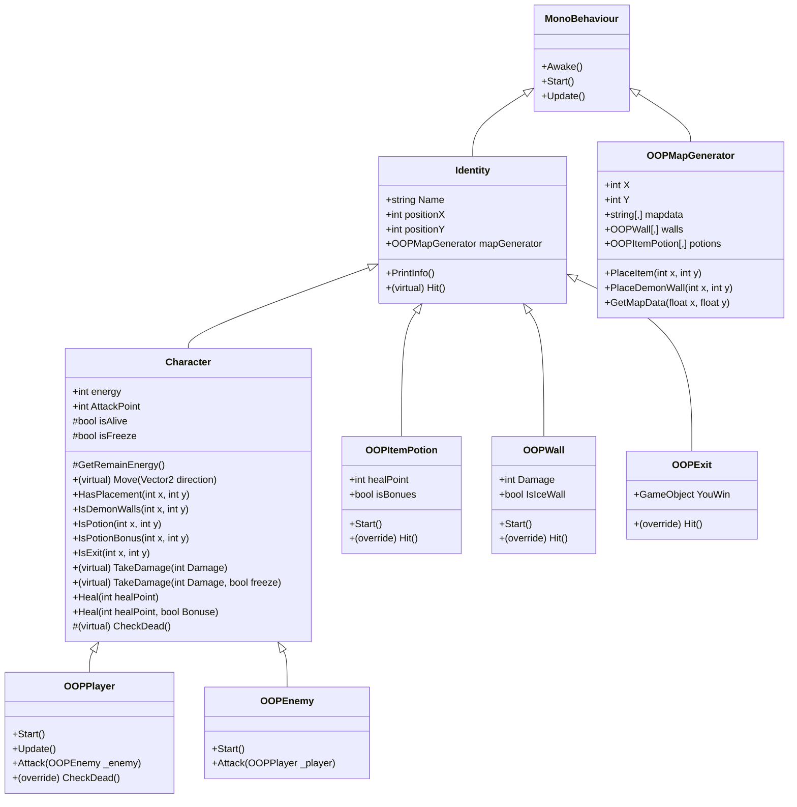

# 🎮 Workshop Guideline: OOP in Unity (Week 03)

A step-by-step implementation and learning guideline for both **students** (self-study / lab practice) and **instructors** (live-lecture walkthrough).

Follow the numbered sequence tags (e.g., `[Type 1.1]`, `[Type 1.2]`, `[Type 2.1]`, etc.) to build the project step-by-step from the starter code in `Student/` up to the final playable version in `Solution/`.

---

## 📋 Table of Contents
1. [Learning Objectives & OOP Concepts](#1-learning-objectives--oop-concepts)
2. [Class Architecture & UML Diagram](#2-class-architecture--uml-diagram)
3. [Starter vs. Solution Overview](#3-starter-vs-solution-overview)
4. [Step-by-Step Implementation Sequence](#4-step-by-step-implementation-sequence)
   - [Phase 1: Base Hierarchy Setup (`Identity.cs`)](#phase-1-base-hierarchy-setup-identitycs)
   - [Phase 2: Core Gameplay Base Class (`Character.cs`)](#phase-2-core-gameplay-base-class-charactercs)
   - [Phase 3: Interactive Entities & Polymorphism (`OOPWall.cs`, `OOPItemPotion.cs`, `OOPExit.cs`)](#phase-3-interactive-entities--polymorphism)
   - [Phase 4: Player & Enemy Controllers (`OOPPlayer.cs`, `OOPEnemy.cs`)](#phase-4-player--enemy-controllers)
   - [Phase 5: Map Generator Refactoring (`OOPMapGenerator.cs`)](#phase-5-map-generator-refactoring-oopmapgeneratorcs)
5. [Unity Inspector & Scene Wiring](#5-unity-inspector--scene-wiring)
6. [Playtest & Verification Matrix](#6-playtest--verification-matrix)
7. [Key Questions & Concept Review](#7-key-questions--concept-review)

---

## 1. Learning Objectives & OOP Concepts

In this workshop, you will learn and apply the core principles of Object-Oriented Programming (OOP):

| OOP Concept | Application in Workshop | Key Keywords |
| :--- | :--- | :--- |
| **Inheritance** | Hierarchy: `Identity` $\rightarrow$ `Character` $\rightarrow$ `OOPPlayer` / `OOPEnemy`, and `Identity` $\rightarrow$ `OOPWall`, `OOPItemPotion`, `OOPExit`. Eliminates code duplication across entities. | `:`, `base` |
| **Polymorphism (Method Overriding)** | `Hit()` defined in `Identity` and overridden uniquely by `OOPWall`, `OOPItemPotion`, and `OOPExit`. `CheckDead()` overridden in `OOPPlayer`. | `virtual`, `override` |
| **Polymorphism (Method Overloading)** | Multiple signatures for `TakeDamage(int)` vs `TakeDamage(int, bool)` and `Heal(int)` vs `Heal(int, bool)`. | Same method name, different parameter signatures |
| **Encapsulation & Access Modifiers** | Protecting internal state (`protected bool isFreeze`, `protected bool isAlive`) while exposing controlled APIs (`TakeDamage`, `Heal`, `Move`). | `public`, `protected`, `private`, `[HideInInspector]` |
| **DRY Principle (Don't Repeat Yourself)** | Overloaded `Heal(int)` delegates directly to `Heal(int, false)`. Common grid attributes (`positionX`, `positionY`, `mapGenerator`) live only in `Identity`. | Code reuse |

---

## 2. Class Architecture & UML Diagram



---

## 3. Starter vs. Solution Overview

| Script | Starter State (`Student/`) | Solution State (`Solution/`) |
| :--- | :--- | :--- |
| `Identity.cs` | Only variables (`Name`, `positionX`, `positionY`, `mapGenerator`). | Added `PrintInfo()` and `virtual void Hit()`. |
| `Character.cs` | Inherits `MonoBehaviour`; duplicates `mapGenerator`; map query methods return dummy `false`; no `Move()` logic implemented. | Inherits `Identity`; implements full `Move()` logic with freeze handling and tile interaction; implements grid checking functions. |
| `OOPPlayer.cs` | Inherits `MonoBehaviour`; contains duplicate `positionX`, `positionY`, `Name`, `mapGenerator`; uses incomplete InputSystem action. | Inherits `Character`; binds Unity Input System (`"Move"` action), reads `moveAction.ReadValue<Vector2>()`, calls `Move(direction)`, `Attack(OOPEnemy)`, and `override CheckDead()`. |
| `OOPEnemy.cs` | Empty class. | Inherits `Character`; implements `Start()` and `Attack(OOPPlayer)`. |
| `OOPWall.cs` | Inherits `MonoBehaviour`; contains duplicate positioning variables; no behavior. | Inherits `Identity`; 20% ice wall chance; overrides `Hit()` to deal damage / freeze player. |
| `OOPItemPotion.cs` | Inherits `MonoBehaviour`; contains duplicate positioning variables; no behavior. | Inherits `Identity`; 20% bonus potion chance; overrides `Hit()` to heal player (2x if bonus). |
| `OOPExit.cs` | Inherits `MonoBehaviour`; contains duplicate positioning variables. | Inherits `Identity`; overrides `Hit()` to disable player and show `YouWin` UI. |
| `OOPMapGenerator.cs` | Inlined instantiations in `while` loops. | Refactored with `PlaceItem(x, y)` and `PlaceDemonWall(x, y)` helper methods. |

---

## 4. Step-by-Step Implementation Sequence

```
┌───────────────────────────────────────────────────────────────────────────────────────────────────┐
│                                   STEP-BY-STEP CODING ORDER                                       │
├─────────────────┬─────────────────┬───────────────────────────────┬───────────────────────────────┤
│ Phase           │ File            │ Sequence IDs                  │ Core OOP Topic Taught         │
├─────────────────┼─────────────────┼───────────────────────────────┼───────────────────────────────┤
│ **Phase 1**     │ `Identity.cs`   │ `[Type 1.1]` ➔ `[Type 1.3]`   │ Base Class & `virtual` hook   │
│ **Phase 2**     │ `Character.cs`  │ `[Type 2.1]` ➔ `[Type 2.10]`  │ Inheritance, Overload, DRY    │
│ **Phase 3.1**   │ `OOPWall.cs`    │ `[Type 3.1.1]` ➔ `[Type 3.1.4]`│ `override Hit()` (Wall/Ice)   │
│ **Phase 3.2**   │ `OOPItemPotion.cs`│ `[Type 3.2.1]` ➔ `[Type 3.2.4]`│ `override Hit()` (Potion/Bonus)│
│ **Phase 3.3**   │ `OOPExit.cs`    │ `[Type 3.3.1]` ➔ `[Type 3.3.3]`│ `override Hit()` (Win State)  │
│ **Phase 4.1**   │ `OOPPlayer.cs`  │ `[Type 4.1.1]` ➔ `[Type 4.1.5]`│ Subclassing `Character`, Input│
│ **Phase 4.2**   │ `OOPEnemy.cs`   │ `[Type 4.2.1]` ➔ `[Type 4.2.3]`│ Subclassing `Character`       │
│ **Phase 5**     │ `OOPMapGenerator.cs`│ `[Type 5.1]` ➔ `[Type 5.3]` │ Refactoring / DRY Helpers     │
└─────────────────┴─────────────────┴───────────────────────────────┴───────────────────────────────┘
```

---

### Phase 1: Base Hierarchy Setup (`Identity.cs`)
📁 **File:** `Assets/Workshop/Student/Scripts/Identity.cs`

> **💡 Concept Note:** *Every interactive entity on our grid (player, enemies, walls, potions, exit) needs a name, a grid coordinate, and a reference to the map generator. `Identity` is the root base class that holds these shared fields and defines a common interaction hook (`Hit()`).*

```csharp
using System.Collections;
using System.Collections.Generic;
using UnityEngine;

// [Type 1.1] Base class inherits from MonoBehaviour
public class Identity : MonoBehaviour
{
    [Header("Identity")]
    public string Name;
    public int positionX;
    public int positionY;
    public OOPMapGenerator mapGenerator;

    // [Type 1.2] Helper method to print identity info
    public void PrintInfo()
    {
        Debug.Log("tell me your " + Name);
    }

    // [Type 1.3] Virtual interaction hook for polymorphism
    public virtual void Hit()
    {
        // Left empty by default; child classes will override this
    }
}
```

**Typing Sequence:**
1. `[Type 1.1]` Keep the existing shared variables (`Name`, `positionX`, `positionY`, `mapGenerator`).
2. `[Type 1.2]` Type `public void PrintInfo()`.
3. `[Type 1.3]` Type `public virtual void Hit()`. The `virtual` keyword allows derived classes to supply their own interaction behaviors.

---

### Phase 2: Core Gameplay Base Class (`Character.cs`)
📁 **File:** `Assets/Workshop/Student/Scripts/Character.cs`

> **💡 Concept Note:** *A `Character` is an `Identity` that can move, take damage, and heal. Instead of duplicating coordinates and map references, `Character` inherits from `Identity`. We also demonstrate Method Overloading for healing and damage.*

```csharp
using System.Collections;
using System.Collections.Generic;
using UnityEngine;

// [Type 2.1] Inherit from Identity instead of MonoBehaviour
public class Character : Identity
{
    // [Type 2.2] Character-specific stats and state flags (Encapsulation)
    [Header("Character")]
    public int energy;
    public int AttackPoint;

    protected bool isAlive;
    protected bool isFreeze;

    // [Type 2.3] Protected debug helper
    protected void GetRemainEnergy()
    {
        Debug.Log(Name + " : " + energy);
    }

    #region Combat & Overloading
    // [Type 2.4] Overloaded TakeDamage (Normal damage)
    public virtual void TakeDamage(int Damage)
    {
        energy -= Damage;
        Debug.Log(Name + " Current Energy : " + energy);
        CheckDead();
    }

    // [Type 2.5] Overloaded TakeDamage (Damage + Freeze effect)
    public virtual void TakeDamage(int Damage, bool freeze)
    {
        energy -= Damage;
        isFreeze = freeze;
        GetComponent<SpriteRenderer>().color = Color.blue;
        Debug.Log(Name + " Current Energy : " + energy);
        Debug.Log("you is Freeze");
        CheckDead();
    }

    // [Type 2.6] Overloaded Heal (DRY: delegates to 2-parameter version)
    public void Heal(int healPoint)
    {
        Heal(healPoint, false);
    }

    // [Type 2.7] Overloaded Heal with Bonus multiplier
    public void Heal(int healPoint, bool Bonuse)
    {
        energy += healPoint * (Bonuse ? 2 : 1);
        Debug.Log("Current Energy : " + energy);
    }

    // [Type 2.8] Virtual death check
    protected virtual void CheckDead()
    {
        if (energy <= 0)
        {
            Destroy(gameObject);
        }
    }
    #endregion

    #region Map Helper Queries
    // [Type 2.9] Connect query methods to mapGenerator data
    public bool HasPlacement(int x, int y)
    {
        var mapData = mapGenerator.GetMapData(x, y);
        return mapData != mapGenerator.empty;
    }

    public bool IsDemonWalls(int x, int y)
    {
        var mapData = mapGenerator.GetMapData(x, y);
        return mapData == mapGenerator.demonWall;
    }

    public bool IsPotion(int x, int y)
    {
        var mapData = mapGenerator.GetMapData(x, y);
        return mapData == mapGenerator.potion;
    }

    public bool IsPotionBonus(int x, int y)
    {
        var mapData = mapGenerator.GetMapData(x, y);
        return mapData == mapGenerator.potion;
    }

    public bool IsExit(int x, int y)
    {
        var mapData = mapGenerator.GetMapData(x, y);
        return mapData == mapGenerator.exit;
    }
    #endregion

    #region Movement & Interaction Dispatch
    // [Type 2.10] Virtual Move method executing grid interactions
    public virtual void Move(Vector2 direction)
    {
        // 1. Defrost check: Skip turn if frozen
        if (isFreeze == true)
        {
            GetComponent<SpriteRenderer>().color = Color.white;
            isFreeze = false;
            return;
        }

        int toX = (int)(positionX + direction.x);
        int toY = (int)(positionY + direction.y);

        // 2. Interactive tile check
        if (HasPlacement(toX, toY))
        {
            if (IsDemonWalls(toX, toY))
            {
                mapGenerator.walls[toX, toY].Hit();
            }
            else if (IsPotion(toX, toY))
            {
                mapGenerator.potions[toX, toY].Hit();
                positionX = toX;
                positionY = toY;
                transform.position = new Vector3(positionX, positionY, 0);
            }
            else if (IsPotionBonus(toX, toY))
            {
                mapGenerator.potions[toX, toY].Hit();
                positionX = toX;
                positionY = toY;
                transform.position = new Vector3(positionX, positionY, 0);
            }
            else if (IsExit(toX, toY))
            {
                mapGenerator.Exit.Hit();
                positionX = toX;
                positionY = toY;
                transform.position = new Vector3(positionX, positionY, 0);
            }
        }
        else
        {
            // 3. Normal step on empty floor: consume 1 energy
            positionX = toX;
            positionY = toY;
            transform.position = new Vector3(positionX, positionY, 0);
            TakeDamage(1);
        }
    }
    #endregion
}
```

**Typing Sequence:**
1. `[Type 2.1]` Change header to `public class Character : Identity`. Remove the duplicate `OOPMapGenerator mapGenerator;` field from the starter code.
2. `[Type 2.2]` Declare `energy`, `AttackPoint`, `protected bool isAlive;`, `protected bool isFreeze;`.
3. `[Type 2.3]` Type `GetRemainEnergy()`.
4. `[Type 2.4] & [Type 2.5]` Type the overloaded `TakeDamage(int)` and `TakeDamage(int, bool)`.
5. `[Type 2.6] & [Type 2.7]` Type `Heal(int, bool)` then type `Heal(int)` delegating to it (*DRY principle*).
6. `[Type 2.8]` Type `protected virtual void CheckDead()`.
7. `[Type 2.9]` Replace dummy `return false;` in `HasPlacement`, `IsDemonWalls`, `IsPotion`, `IsPotionBonus`, and `IsExit` with real `mapGenerator.GetMapData(x, y)` checks.
8. `[Type 2.10]` Implement `Move(Vector2 direction)`:
   - Part A: Freeze check (`if (isFreeze) ...`).
   - Part B: Target coordinates `toX, toY`.
   - Part C: Placement check branching into `.Hit()` calls.
   - Part D: Normal move with `TakeDamage(1)`.

---

### Phase 3: Interactive Entities & Polymorphism

> **💡 Concept Note:** *Each map object inherits from `Identity` and overrides `Hit()`. When the player walks into them, `Character.Move()` simply triggers `.Hit()`, letting polymorphism execute the appropriate behavior.*

#### 3.1 Demon Wall (`OOPWall.cs`)
📁 **File:** `Assets/Workshop/Student/Scripts/OOPWall.cs`

```csharp
using System.Collections;
using System.Collections.Generic;
using UnityEngine;

// [Type 3.1.1] Inherit from Identity (remove duplicate position and name variables)
public class OOPWall : Identity
{
    // [Type 3.1.2] Wall properties
    public int Damage;
    public bool IsIceWall;

    // [Type 3.1.3] 20% random chance to become an Ice Wall
    private void Start()
    {
        IsIceWall = Random.Range(0, 100) < 20 ? true : false;
        if (IsIceWall)
        {
            GetComponent<SpriteRenderer>().color = Color.blue;
        }
    }

    // [Type 3.1.4] Polymorphic Hit implementation
    public override void Hit()
    {
        if (IsIceWall)
        {
            mapGenerator.player.TakeDamage(Damage, IsIceWall);
        }
        else
        {
            mapGenerator.player.TakeDamage(Damage);
        }

        // Clear grid cell and destroy GameObject
        mapGenerator.mapdata[positionX, positionY] = mapGenerator.empty;
        Destroy(gameObject);
    }
}
```

**Typing Sequence:**
1. `[Type 3.1.1]` Change `public class OOPWall : MonoBehaviour` to `: Identity`. Delete duplicate fields `Name`, `positionX`, `positionY`, `mapGenerator`.
2. `[Type 3.1.2]` Type `public int Damage;` and `public bool IsIceWall;`.
3. `[Type 3.1.3]` Type `Start()` with 20% chance roll.
4. `[Type 3.1.4]` Type `public override void Hit()`.

---

#### 3.2 Potion Item (`OOPItemPotion.cs`)
📁 **File:** `Assets/Workshop/Student/Scripts/OOPItemPotion.cs`

```csharp
using System.Collections;
using System.Collections.Generic;
using UnityEngine;

// [Type 3.2.1] Inherit from Identity
public class OOPItemPotion : Identity
{
    // [Type 3.2.2] Potion properties
    public int healPoint = 10;
    public bool isBonues;

    // [Type 3.2.3] 20% chance to become a Bonus Potion
    private void Start()
    {
        isBonues = Random.Range(0, 100) < 20 ? true : false;
        if (isBonues)
        {
            GetComponent<SpriteRenderer>().color = Color.blue;
        }
    }

    // [Type 3.2.4] Polymorphic Hit implementation
    public override void Hit()
    {
        if (isBonues)
        {
            mapGenerator.player.Heal(healPoint, isBonues);
            Debug.Log("You got " + Name + " Bonues : " + (healPoint * 2));
        }
        else
        {
            mapGenerator.player.Heal(healPoint);
            Debug.Log("You got " + Name + " : " + healPoint);
        }

        mapGenerator.mapdata[positionX, positionY] = mapGenerator.empty;
        Destroy(gameObject);
    }
}
```

**Typing Sequence:**
1. `[Type 3.2.1]` Change base class to `Identity`. Delete duplicate fields.
2. `[Type 3.2.2]` Type `public int healPoint = 10;` and `public bool isBonues;`.
3. `[Type 3.2.3]` Type `Start()` bonus roll.
4. `[Type 3.2.4]` Type `public override void Hit()`.

---

#### 3.3 Exit Tile (`OOPExit.cs`)
📁 **File:** `Assets/Workshop/Student/Scripts/OOPExit.cs`

```csharp
using System.Collections;
using System.Collections.Generic;
using UnityEngine;

// [Type 3.3.1] Inherit from Identity
public class OOPExit : Identity
{
    // [Type 3.3.2] Reference to UI Victory element
    public GameObject YouWin;

    // [Type 3.3.3] Trigger win state on Hit
    public override void Hit()
    {
        mapGenerator.player.enabled = false;
        if (YouWin != null)
        {
            YouWin.SetActive(true);
        }
        Debug.Log("You win");
    }
}
```

**Typing Sequence:**
1. `[Type 3.3.1]` Change base class to `Identity`. Delete duplicate fields.
2. `[Type 3.3.2]` Type `public GameObject YouWin;`.
3. `[Type 3.3.3]` Type `public override void Hit()`.

### Phase 4: Player & Enemy Controllers

> **💡 Concept Note:** *Both Player and Enemy are `Character`s. The Player integrates Unity's Input System to handle grid movement and overrides `CheckDead()` to display a custom death notification.*

#### 4.1 Player Controller (`OOPPlayer.cs`)
📁 **File:** `Assets/Workshop/Student/Scripts/OOPPlayer.cs`

```csharp
using System.Collections;
using System.Collections.Generic;
using UnityEngine;
using UnityEngine.InputSystem;

// [Type 4.1.1] Inherit from Character (removes duplicate positioning variables)
public class OOPPlayer : Character
{
    // [Type 4.1.2] Reference to the Move InputAction
    private InputAction moveAction;

    // [Type 4.1.3] Initialize input binding and inherited methods in Start
    public void Start()
    {
        moveAction = InputSystem.actions.FindAction("Move");
        PrintInfo();
        GetRemainEnergy();
    }

    // [Type 4.1.4] Read Vector2 input and trigger Move
    public void Update()
    {
        Vector2 direction = moveAction.ReadValue<Vector2>();
        Move(direction);
    }

    // [Type 4.1.5] Interaction with Enemy subclass
    public void Attack(OOPEnemy _enemy)
    {
        _enemy.energy -= AttackPoint;
        Debug.Log(_enemy.name + " is energy " + _enemy.energy);
    }

    // [Type 4.1.6] Override base CheckDead with custom player notification
    protected override void CheckDead()
    {
        base.CheckDead();
        if (energy <= 0)
        {
            Debug.Log("Player is Dead");
        }
    }
}
```

**Typing Sequence:**
1. `[Type 4.1.1]` Change class declaration to `public class OOPPlayer : Character`. Delete duplicate variables (`Name`, `positionX`, `positionY`, `mapGenerator`).
2. `[Type 4.1.2]` Declare `private InputAction moveAction;`.
3. `[Type 4.1.3]` In `Start()`, bind the action `moveAction = InputSystem.actions.FindAction("Move");` and call inherited methods: `PrintInfo();` and `GetRemainEnergy();`.
4. `[Type 4.1.4]` In `Update()`, read `Vector2 direction = moveAction.ReadValue<Vector2>();` and pass it directly to `Move(direction);`.
5. `[Type 4.1.5]` Type `public void Attack(OOPEnemy _enemy)`.
6. `[Type 4.1.6]` Type `protected override void CheckDead()`.

---

#### 4.2 Enemy Controller (`OOPEnemy.cs`)
📁 **File:** `Assets/Workshop/Student/Scripts/OOPEnemy.cs`

```csharp
using System.Collections;
using System.Collections.Generic;
using UnityEngine;

// [Type 4.2.1] Inherit from Character
public class OOPEnemy : Character
{
    // [Type 4.2.2] Initialize
    public void Start()
    {
        GetRemainEnergy();
    }

    // [Type 4.2.3] Enemy attack targeting Player
    public void Attack(OOPPlayer _player)
    {
        _player.energy -= AttackPoint;
        Debug.Log("player is energy " + _player.energy);
    }
}
```

**Typing Sequence:**
1. `[Type 4.2.1]` Type `public class OOPEnemy : Character`.
2. `[Type 4.2.2]` Type `Start()` calling `GetRemainEnergy()`.
3. `[Type 4.2.3]` Type `public void Attack(OOPPlayer _player)`.

---

### Phase 5: Map Generator Refactoring (`OOPMapGenerator.cs`)
📁 **File:** `Assets/Workshop/Student/Scripts/OOPMapGenerator.cs`

> **💡 Concept Note:** *We extract repetitive object instantiation loops in `Start()` into modular helper methods `PlaceDemonWall` and `PlaceItem`.*

```csharp
    // [Type 5.1] Helper method for spawning Demon Walls
    public void PlaceDemonWall(int x, int y)
    {
        int r = Random.Range(0, demonWallsPrefab.Length);
        GameObject obj = Instantiate(demonWallsPrefab[r], new Vector3(x, y, 0), Quaternion.identity);
        obj.transform.parent = wallParent;
        mapdata[x, y] = demonWall;
        walls[x, y] = obj.GetComponent<OOPWall>();
        walls[x, y].positionX = x;
        walls[x, y].positionY = y;
        walls[x, y].mapGenerator = this;
        obj.name = $"DemonWall_{walls[x, y].Name} {x}, {y}";
    }

    // [Type 5.2] Helper method for spawning Potion Items
    public void PlaceItem(int x, int y)
    {
        int r = Random.Range(0, itemsPrefab.Length);
        GameObject obj = Instantiate(itemsPrefab[r], new Vector3(x, y, 0), Quaternion.identity);
        obj.transform.parent = itemPotionParent;
        mapdata[x, y] = potion;
        potions[x, y] = obj.GetComponent<OOPItemPotion>();
        potions[x, y].positionX = x;
        potions[x, y].positionY = y;
        potions[x, y].mapGenerator = this;
        obj.name = $"Item_{potions[x, y].Name} {x}, {y}";
    }
```

**Typing Sequence:**
1. `[Type 5.1]` Add `PlaceDemonWall(int x, int y)` to bottom of class.
2. `[Type 5.2]` Add `PlaceItem(int x, int y)` to bottom of class.
3. `[Type 5.3]` In `Start()`, replace repetitive loop bodies with single calls to `PlaceDemonWall(x, y);` and `PlaceItem(x, y);`.

---

## 5. Unity Inspector & Scene Wiring

Open `Student/Scenes/OOP.unity` and verify the following Inspector configurations:

```
Hierarchy Structure:
├── MapController        ➔ [OOPMapGenerator] component (X: 8, Y: 8, Obstacles: 5, Potions: 5)
├── Player               ➔ [OOPPlayer] component (Name: "Hero", Energy: 50, AttackPoint: 10)
├── Exit                 ➔ [OOPExit] component (Name: "Exit", YouWin: drag Canvas/YouWin)
├── Canvas
│   └── YouWin           ➔ Text/Panel GameObject (Disabled by default in Scene)
└── Parents (Empty transforms for hierarchy organization):
    ├── FloorParent
    ├── WallParent
    └── ItemPotionParent
```

---

## 6. Playtest & Verification Matrix

Run the scene in Unity Editor and verify each mechanic sequentially:

| Step | Action | Expected Visual & Console Result |
| :---: | :--- | :--- |
| **1** | Press `Play` in Editor | Grid generates. Console prints: `tell me your Hero` & `Hero : 50`. |
| **2** | Press Move input (WASD / Arrow Keys via Input System) into empty floor | Hero moves 1 unit. Energy drops by 1 (`Current Energy: 49`). |
| **3** | Walk into standard Potion (Orange/Red) | Player heals +10. Tile destroyed. Log: `You got Potion : 10`. |
| **4** | Walk into Bonus Potion (Blue) | Player heals +20. Tile destroyed. Log: `You got Potion Bonues : 20`. |
| **5** | Walk into normal Demon Wall | Player takes damage. Wall destroyed. |
| **6** | Walk into Ice Demon Wall (Blue) | Player takes damage, turns **Blue**, log: `you is Freeze`. Next input defrosts player without moving. |
| **7** | Walk to top-right Exit tile | Player movement is disabled, `YouWin` UI appears, log: `You win`. |
| **8** | Deplete Energy to `0` | Player GameObject is destroyed, log: `Player is Dead`. |

---

## 7. Key Questions & Concept Review

1. **Why use Inheritance here?**
   - Without inheritance, every class duplicates `positionX`, `positionY`, and `mapGenerator`. If we add a new property like `positionZ` or grid rotation, we would have to modify 6 different files instead of just 1 (`Identity`).
2. **Why use Polymorphism (`virtual` / `override`)?**
   - By delegating collision handling to `.Hit()`, `Character` does not need to know whether the tile is a wall, potion, trap, or exit. Adding new items requires zero changes to `Character.Move()`.
3. **Difference between Overloading and Overriding:**
   - *Overloading (Compile-time):* Same method name, different parameter signature in the same or parent class (`TakeDamage(int)` vs `TakeDamage(int, bool)`).
   - *Overriding (Runtime):* Derived class replaces the implementation of a parent's `virtual` method with the exact same signature (`Hit()`, `CheckDead()`).
